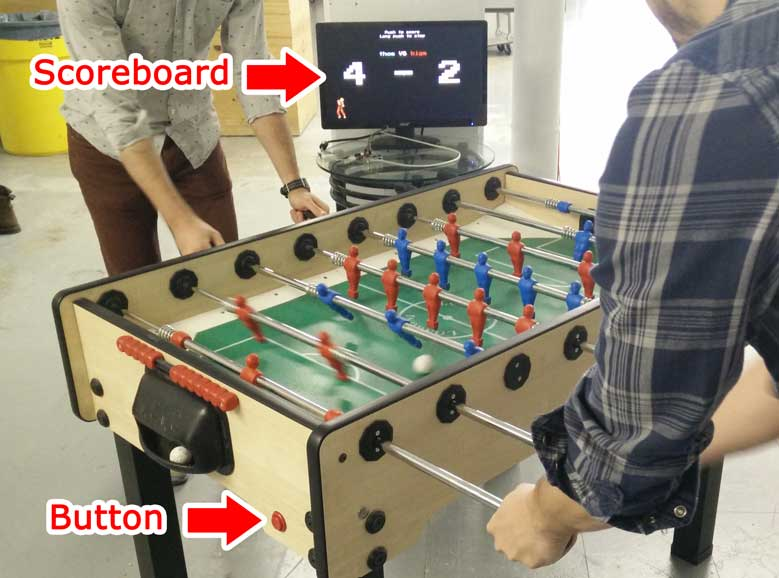

# babpi
Follow score and rank players for your football table games, using a [Raspberry Pi](https://www.raspberrypi.org/).



Features:

* Game booking
* Player ranking using XBox's Trueskill algorithm.
* History for all games played
* Simple wiring
* ... or if you want, MSP430 + nrf24l01 transceiver support for wireless with all sources
* Retro look'n'feel

You'll need:

* A Football table
* [Raspberry-pi B+ or later](https://www.raspberrypi.org)
* A screen (to display current game scoreboard)
* Two arcade plunger buttons (to increment score and interact with scoreboard)
* Basic shell understanding
* A few wires

## Installation
### For development
babpi can be run straight from your dev machine with:

    npm install
    npm run dev

Then just open http://127.0.0.1:3000/ in your favorite browser. You can mock the button interface by pressing a, A, b and B.

### Raspberry pi
Follow [this tutorial](https://blog.gordonturner.com/2017/12/10/raspberry-pi-full-screen-browser-raspbian-december-2017/) to get a Pi that starts in kiosk mode (use the following kiosk url ```--kiosk http://127.0.0.1:3000/scoreboard```).

You already have ```git```, ```pip``` ```python``` and ```node``` if you followed the tutorial.

Run the following commands once ssh logged:

    # Setup python for the ranking system
    sudo pip install trueskill

    # We need npm
    sudo apt-get -y install npm

    # Lets put babpi inside the /opt folder
    sudo mkdir /opt/babpi
    sudo chown pi: /opt/babpi
    cd /opt/babpi
    git clone https://github.com/dav-m85/babpi.git .

    # Install dependencies and build the thing
    npm install
    mkdir public
    npm run build

    # Run the server for a test
    node server.js

Opening ```http://ip-of-your-raspberrypi:3000/scoreboard``` should display... the scoreboard.

From here, depending on your hardware setup, you can decide to use one of the following input method:

- **wire**: Pi GPIO is directly connected to the buttons.
- **radio**: A nrf24 remote board is used. You connect a nrf24l01 to the GPIO.

Installation differs for both methods.

#### wire ####
Just wire the buttons straight to the Pi GPIO. By default GPIO17 and 18 are used.

    # We need the on off library
    npm install onoff
    # Lets activate pull ups
    sudo apt-get install device-tree-compiler
    dtc -@ -I dts -O dtb -o mygpio-overlay.dtb hardware/wire/mygpio-overlay.dts
    sudo cp mygpio-overlay.dtb /boot/overlays/mygpio-overlay.dtb
    echo "device_tree_overlay=overlays/mygpio-overlay.dtb" | sudo tree /boot/config.txt
    sudo reboot

Sorry for not giving more info, I don't have many since I'm using the radio myself. I just know it worked at some point.

#### radio ####
A remote radio input is supported with a board running a MSP430G2 and a [nRF24L01](http://www.nordicsemi.com/eng/Products/2.4GHz-RF/nRF24L01).

You'll need to wire appropriately the module:

https://forum.mysensors.org/topic/2437/step-by-step-procedure-to-connect-the-nrf24l01-to-the-gpio-pins-and-use-the-raspberry-as-a-serial-gateway-mysensors-1-x

NRF24L01  Pin	NRF24L01	RPi2	RPi2 – Connector Pin
1	GND	rpi-gnd	(25)
2	VCC	rpi-3v3	(17)
3	CE	rpi-gpio22	(15)
4	CSN	rpi-gpio8	(24)
5	SCK	rpi-sckl	(23)
6	MOSI	rpi-mosi	(19)
7	MISO	rpi-miso	(21)
8	IRQ	rpi-gpio25 (22)

250KBPS

The MSP firmware is available in the [radio folder](./hardware/radio). The Pi installation needs a bit of tweaking:

    npm install nrf

    # edit rc.local
    echo "22" >> /sys/class/gpio/export
    echo "25" >> /sys/class/gpio/export
    ...
    exit 0;

##### Compiling the firmware
There's decent tutorials on TI explaining how to achieve that. For fellow programmers, make sure you [activate HEX output like described here](http://processors.wiki.ti.com/index.php/Generating_and_Loading_MSP430_Binary_Files).

If you are on Mac OS X and uses one of the unsupported launchpad boards (MSP-EXP430G2 like me), you can flash with mspdebug (found in Energia):

    alias mspdebug /Applications/Energia.app/Contents/Java/hardware/tools/msp430/bin/mspdebug
    mspdebug rf2500
    (mspdebug) prog /absolute/path/to/project/firmware.txt

### Misc ###
sudo nano /lib/systemd/system/babpi.service
sudo systemctl enable babpi.service

    [Unit]
    Description=Babpi
    After=network.target

    [Service]
    ExecStart=/usr/bin/node server.js
    WorkingDirectory=/opt/babpi
    StandardOutput=inherit
    StandardError=inherit
    Restart=always
    User=pi

    [Install]
    WantedBy=multi-user.target

sudo nano .config/lxsession/LXDE-pi/autostart

    @lxpanel --profile LXDE-pi
    @pcmanfm --desktop --profile LXDE-pi
    #@xscreensaver -no-splash
    @point-rpi

    # BEGIN ADDED

    # Normal website that does not need any exceptions
    @/usr/bin/chromium-browser --incognito --start-maximized --kiosk http://127.0.0.1/scoreboard
    # Enable mixed http/https content, remember if invalid certs were allowed (ie self signed certs)
    #@/usr/bin/chromium-browser --incognito --start-maximized --kiosk --allow-running-insecure-content --remember-cert-error-dec$
    @unclutter
    @xset s off
    @xset s noblank
    @xset -dpms

    # END ADDED

## TODO
There's still a few things I would like to improve:

* Deal with longClick and shortClick on the GPIO
* Autocomplete player in book page
* Competition mode
* Nicer scoreboard
* Write doc and hardware guide
* long click cancel point instead of canceling game
* long click on both sides cancel the game
* General code cleanup
* Provide graph with player stats, http://nvd3.org/examples/cumulativeLine.html

Feel free to do a Pull Request.

## References
* http://hackaday.com/2015/12/09/embed-with-elliot-debounce-your-noisy-buttons-part-i/ (debouncing them all)
* http://www.moserware.com/2010/03/computing-your-skill.html (amazing resource on trueskill)
* https://davidwalsh.name/street-fighter (the ken used on first page)
* http://www.framboise314.fr/faire-dialoguer-un-raspberry-et-un-arduino-via-nrf24l01/#Installation_de_SPI (wireless inspiration)

## Other projects
* http://blog.makingwaves.com/technology/the-foosball-table-live-status-system/
* http://austin.foos.buzz/about
* https://developer.ibm.com/bluemix/2015/08/06/built-iot-foosball-table-ibm-bluemix/
* https://www.reddit.com/r/AskElectronics/comments/2rqlhy/help_with_building_an_electronic_foosball_scoring/
* http://www.semageek.com/projet-le-robot-champion-de-babyfoot-de-epfl/
* Check [pongdome](https://github.com/busbud/pongdome) it's quite the same thing
